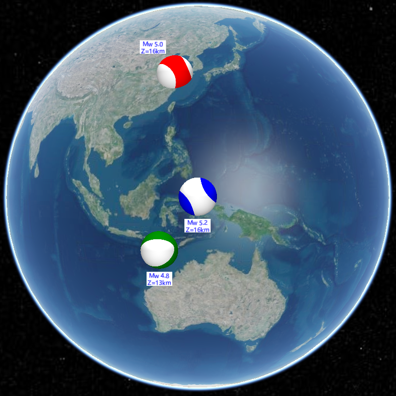

# beach-ball
基于```python```语言开发的生成地震领域沙滩球纹理图的源码，支持断层参数和矩张量参数

# 文件说明

```calBeachBallData``` 是计算地震沙滩球辐射花样振幅的核心算法程序，支持```linux```和```macos```系统，```.exe```为```windows```系统下计算程序

```main.py``` 为主程序，用于调用```calBeachBallData```程序进行计算并对计算结果进行绘制，最终生成对应的图片

```demo.py``` 为演示案例，提供了断层参数和矩张量两种参数案例

# 部署

需安装绘制包 ```matplotlib```，运行 ```pip install matplotlib``` 即可

# 关于纹理的绘制

```main.py``` 中的 ```genBeachBallTexture```函数是对应的计算与绘制函数，具体绘制代码在此函数中，程序默认的输出是纹理图，即不带边框和刻度的，如为了展示需要带刻度和边框，可注掉并打开相应的绘制代码即可

# 关于纹理图片后续的使用

生成的纹理图可在```Cesium```等绘制平台用做球面纹理，绘制出来的球就是三维沙滩球，```demo```案例中的断层参数对应的沙滩球显示

>demo-断层参数  


>demo-矩张量  
